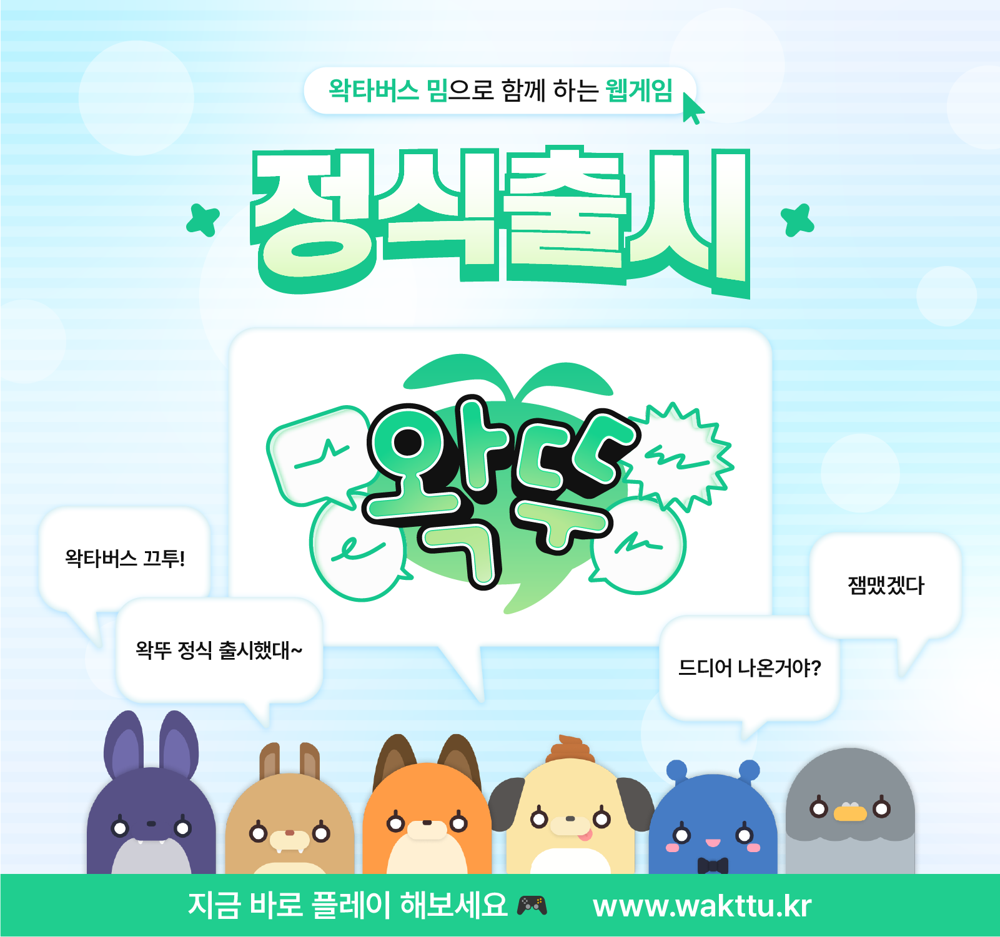
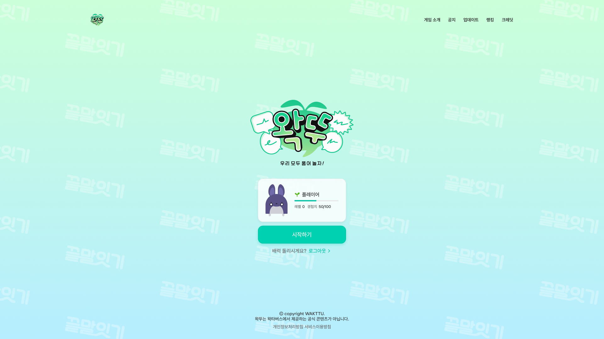
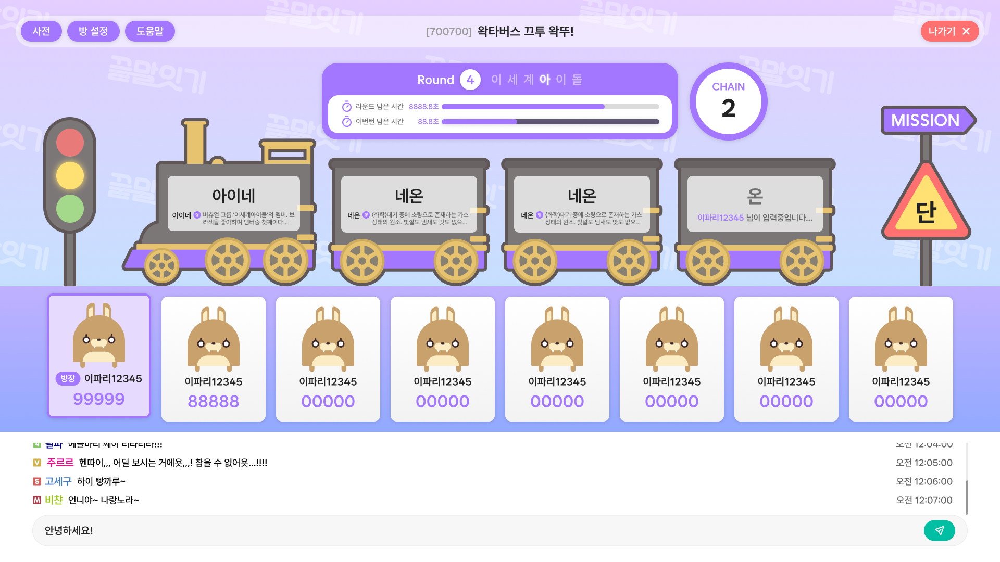
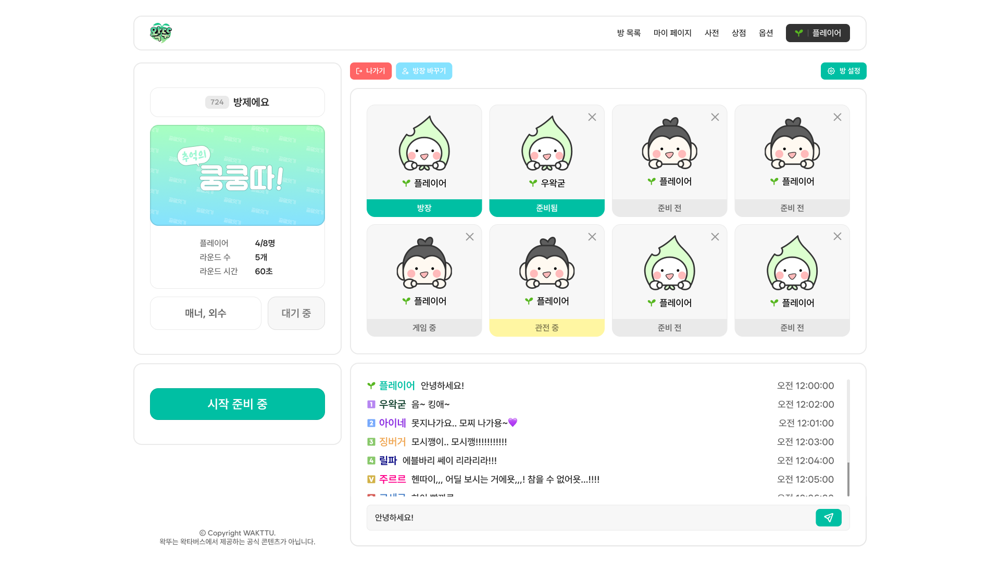
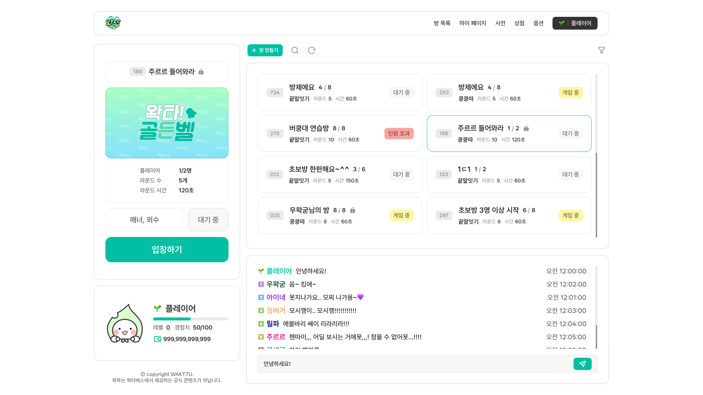

## 왁뚜 (Wakttu) — 실시간 멀티 게임 · 사전 · 업적 플랫폼 (Frontend)

왁타버스 세계관을 즐길 수 있는 실시간 멀티 파티 게임과 사전, 업적/아이템 수집 기능을 제공하는 웹 서비스의 프런트엔드 레포지토리입니다. 방 생성/입장, 팀 선택, 채팅/이모티콘, 다양한 게임 모드(끝말잇기·쿵쿵따·종치기·음악·클라우드), 랭킹/마이페이지 등 주요 기능을 제공합니다.


### 주요 기능
- **실시간 멀티플레이**: `socket.io-client` 기반 실시간 통신으로 로비/방/게임 이벤트 처리
- **게임 모드**: `Last(끝말잇기)`, `Kung(쿵쿵따)`, `Bell`, `Music`, `Cloud` 지원
- **방 시스템**: 방 생성/업데이트/비밀번호/준비 토글/팀 선택, 킥 등 관리 기능
- **채팅/이모티콘**: 로비/방 채팅 및 이모티콘 전송
- **사전/검색**: 단어 검색 UI 제공
- **업적/아이템**: 플레이 기록/결과를 API로 전송하여 업적/아이템 획득
- **랭킹/마이페이지**: 사용자 정보 및 스타일/이모티콘 관리
- **반응형 폰트 스케일링**: 데스크톱 최적화, 모바일 접속 시 안내 처리


### 기술 스택
- **Framework**: Next.js 15, React 19, TypeScript
- **State**: Redux Toolkit, Redux Persist, React-Redux
- **Data**: React Query (TanStack Query)
- **Styling**: styled-components
- **Realtime**: socket.io-client
- **HTTP**: Axios
- **Build**: Next.js Export(SSG) + `serve`


### 프로젝트 구조(요약)
```
src/
  components/        // UI 컴포넌트 (공통, 게임, 사전, 메인, 마이페이지, 방 등)
  containers/        // 페이지 컨테이너(상태/로직 연결)
  pages/             // Next.js Pages 라우팅
  redux/             // Redux slices, store, persist 설정
  services/          // API 클라이언트, socket 래퍼
  hooks/             // 커스텀 훅
  modules/           // 유틸 모듈(폰트 스케일, 날짜, 점수 등)
  styles/            // 전역/도메인 스타일
  utils/             // 유틸 함수 모음
```


### 실행 방법
사전에 Node.js와 Yarn이 설치되어 있어야 합니다.

1) 의존성 설치
```bash
yarn
```

2) 개발 서버 실행 (Turbopack)
```bash
yarn dev
# http://localhost:3000
```

3) 빌드 및 정적 Export
Next 설정(`next.config.ts`)은 `output: 'export'`를 사용합니다. 정적 파일을 생성하여 어느 정적 서버에서도 서빙할 수 있습니다.
```bash
yarn build
npx next export
# 기본 출력 경로: ./out
```

4) 정적 파일 서빙(로컬 확인)
`package.json`의 `start` 스크립트는 `out` 폴더를 서빙합니다.
```bash
yarn start
# serve ./out
```


### 환경 변수
`src/services/api.ts`에서 사용하는 공개 환경 변수입니다.
```bash
# .env.local (예시)
NEXT_PUBLIC_API_URL=https://api.example.com
NEXT_PUBLIC_R2_URL=https://cdn.example.com
NEXT_PUBLIC_WAKGAME_URL=https://game.example.com
```
- `API_URL`은 REST API 및 소켓 네임스페이스(`/wakttu`)의 베이스 URL로 사용됩니다.
- `R2_URL`은 업적/이모티콘 등의 정적 리소스 경로 생성을 위해 사용됩니다.
- `WAKGAME_URL`은 게임 관련 별도 리소스 접근에 사용됩니다.


### 상태 관리
- `redux-persist`로 `user`, `audio` 상태를 영속화
- 그 외 모듈은 비영속(모달, 방정보, 게임, 필터, 정답, 타이머, 히스토리, 결과, 업적, 음악)

```startLine:endLine:filepath
1:31:src/redux/store.ts
import { combineReducers, configureStore } from '@reduxjs/toolkit';
// ... 중략 ...
const persistConfig = {
  key: 'root',
  storage,
  whitelist: ['user', 'audio'],
  blacklist: [
    'modal','roomInfo','game','filter','answer','timer','history','result','achieve',
  ],
};
```


### 네트워킹
- Axios 인스턴스: `withCredentials: true`
- 주요 API: 업적/아이템/통계 갱신, 결과 전송 등
- 소켓 네임스페이스: `${NEXT_PUBLIC_API_URL}/wakttu`

```startLine:endLine:filepath
1:15:src/services/api.ts
export const API_URL = process.env.NEXT_PUBLIC_API_URL;
export const client = axios.create({ baseURL: API_URL, withCredentials: true });
```

```startLine:endLine:filepath
1:10:src/services/socket/socket.ts
import { io } from 'socket.io-client';
import { API_URL } from '../api';

export const socket = io(`${API_URL}/wakttu`, {
  withCredentials: true,
  autoConnect: false,
  reconnection: true,
  reconnectionAttempts: 5,
  transports: ['websocket'],
});
```


### 주요 페이지
- `/` 메인: 헤더/메인 폼/서비스 소개, 인증 모달 연동
- `/game/*` 게임 라우트: `bell`, `cloud`, `kung`, `last`, `music`
- `/room`, `/roomlist`: 방 생성/목록/입장/비밀번호/준비/팀 선택
- `/mypage`: 내 캐릭터/이모티콘/스타일
- `/dictionary`: 단어 검색/리스트


### 개발 메모
- 전역 스타일 및 PDF 전용 스타일 분리 적용
- 모바일 접속 시 PC 안내 렌더링 처리
- ESLint 오류가 빌드 실패를 막지 않도록 설정되어 있음 (`ignoreDuringBuilds: true`)


### 스크립트
```json
{
  "dev": "next dev --turbopack",
  "build": "next build",
  "start": "npx serve@latest out",
  "lint": "next lint"
}
```


### 스크린샷

메인 홈, 인게임, 방 내부, 방 리스트 화면 예시입니다.










### 라이선스 및 고지
- 본 레포지토리는 포트폴리오 목적의 프런트엔드 코드이며, 일부 API/리소스는 사설 인프라에 의존합니다.
- 상표/이미지/리소스의 권리는 각 소유자에게 있습니다.


### 연락처
포트폴리오 관련 문의: 이메일 또는 링크드인/깃허브 링크를 여기에 기입하세요.

